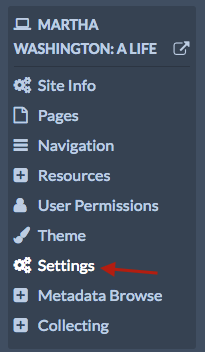

# Partage

Le [module](../modules/modules.md) de partage vous permet d'ajouter des boutons aux pages des sites afin que les visiteurs puissent les utiliser pour partager et embarquer les contenus sur les réseaux sociaux ou par courriel.

Actuellement, ce module de partage supporte les services suivants :
- Facebook
- Twitter
- Tumblr
- Pinterest
- Email
- Embed codes

Dès que ce modèle a été [installé](../modules/modules.md#installing-modules) et activivé, il est disponible pour tous les sites gérés par l'installation.

## Configuration

Les paramètres de partage sont configurés site par site.

Accédez au site pour lequel vous souhaitez configurer le module de partage et cliquez sur le tableau de bord du site d'édition. Cliquez sur Paramètres du site.

Il devrait y avoir une section qui ressemble à l'image ci-après, avec l'étiquette *Enable Sharing module for these methods*  suivie d'une série de cases à cocher pour chaque service ou option.

Assurez-vous que ce sont bien les services appropriés qui sont activés pour votre site. Vous pouvez désélectionner toutes les cases pour désactiver le partage de votre site. Veillez à enregistrer vos modifications.

Les icônes de partage pour les services et les options activés s'affiche au bas des pages que vous créez ainsi que sur les pages d'affichage individuel des items sur votre site.

Par défaut, ce module partagera le titre de la page ou de l'item, le nom du site et le nom de l'installation.

